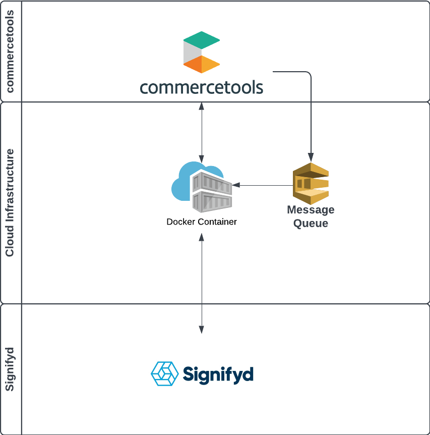

# Building and Deployment

To streamline building process plugin project has been dockerized. With that way every dependency and process steps are arranged through docker image. Docker file  starts with amazoncorretto:11 base image. Then simply addition of maven support to image. After that step the image is ready for building commands. Depending of the solution choice image will build and deploy to connector plugin.

The Dockerfiles can be found in [Functions.Dockerfile](../../Functions.Dockerfile) and [Server.Dockerfile](../../Server.Dockerfile)

## Serverless solution

The plugin currently supports [AWS Lambda](https://aws.amazon.com/lambda/), [Google Cloud Functions](https://cloud.google.com/functions) and [Azure Functions](https://azure.microsoft.com/en-us/products/functions/). With Function image function projects could be build. With run command the builds will deployed to the related clould environment.

### Build

```shell
docker build -f Functions.Dockerfile -t signifyd-functions .
docker run signifyd-functions  
```

## Dockerized Container solution



The dockerized container solution is web server that expose functions as endpoints. [Spring Boot](https://spring.io/projects/spring-boot) framework used as web server solution. With building the image both functions and server will be build and running the container a web service will be ready  at port 8080.

## Build

```shell
docker build -f Server.Dockerfile -t signifyd-connector-server .

```
