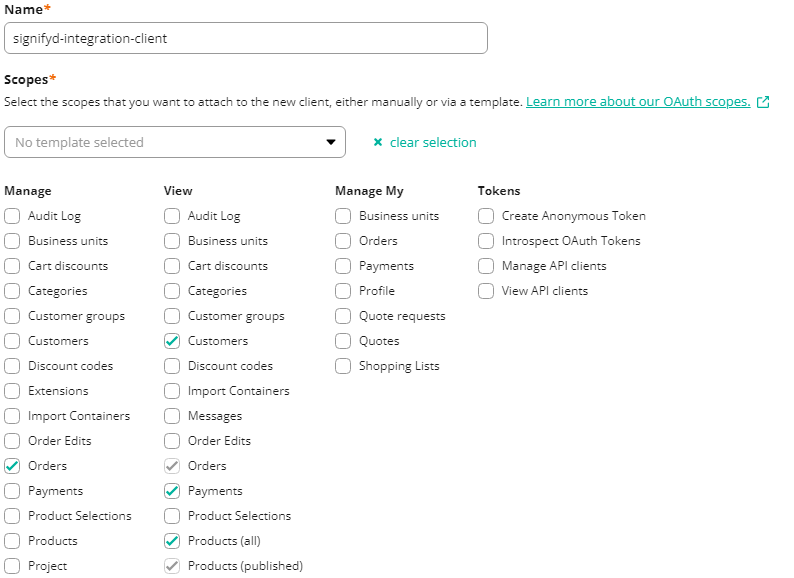

# commercetools and storefront setup

## -API Client

To this integration works the below scopes are required for API Client that going to be configured under config file.

`manage_orders`,`view_customers`,`view_payments`,`view_products`

To create this API Client use the below image as guidance 



or via using REST API of commercetools with the below scope.

> https://docs.commercetools.com/api/projects/api-clients#create-api-client

```
{
  "name" : "signifyd-integration-client",
  "scope" : "view_customers:{{project-key}} view_payments:{{project-key}} view_products:{{project-key}} manage_orders:{{project-key}}"
}
```

## -API Extension

If pre auth is the prefered fraud detection flow for this integration, commercetools Api Extension is needed for pre auth service. If post auth flow used this configuration **is not required**

Before setting this up time limit of the API extensions in commercetools project needs to increased. Because of the re-try mechanism of Signifyd request in the integration and Signifyd response time window to a request, commercetools 2 seconds time limitation on API extension requests is not enough to perfrom all. ([documentation](https://docs.commercetools.com/api/projects/api-extensions#time-limits)) 

To increase that limitation you need contact Support Portal of commercetools ([documentation](https://docs.commercetools.com/api/projects/api-extensions#set-timeoutinms))

Create an Api Extension for **order** with **Create** action using below request and for respective infrastruce change the destination obejct based on [documentation](https://docs.commercetools.com/api/projects/api-extensions#create-extension)

```
{
    "key": "signifyd-order-extension",
    "destination": {},
    "triggers": [
        {
            "resourceTypeId": "order",
            "actions": [
                "Create"
            ]
        }
    ],
    "timeoutInMs": 10000
}
```

## -Subscriptions

To feed order and payment related notifications to the integration subscriptions is needed.

Subscriptions requires a messaging service to operate and this integration supports services are listed below

- Amazon Web Services SNS

- Amazon Web Services SQS

- Azure Event Grid

- Google Cloud Pub Sub

Subscription serive uses predefined messages of commercetools 

Messages that required and purpose of them in Signifyd Fraud detection listed below.

| Message Key                        | Purpose                  |
| ---------------------------------- | ------------------------ |
| PaymentTransactionAdded            | Transaction API          |
| PaymentTransactionStateChanged     | Transaction API          |
| OrderCreated                       | Post Auth Sale API       |
| OrderShippingAddressSet            | Post Sale Reroute API    |
| DeliveryAdded                      | Post Sale Fulfilment API |
| OrderLineItemAdded                 | Post Sale Reprice API    |
| OrderLineItemRemoved               | Post Sale Reprice API    |
| OrderCustomLineItemAdded           | Post Sale Reprice API    |
| OrderCustomLineItemRemoved         | Post Sale Reprice API    |
| OrderCustomLineItemQuantityChanged | Post Sale Reprice API    |
| OrderCustomLineItemDiscountSet     | Post Sale Reprice API    |
| OrderShippingInfoSet               | Post Sale Reprice API    |
| OrderShippingRateInputSet          | Post Sale Reprice API    |
| OrderDiscountCodeAdded             | Post Sale Reprice API    |
| OrderDiscountCodeRemoved           | Post Sale Reprice API    |
| OrderDiscountCodeStateSet          | Post Sale Reprice API    |

To create this subscription use the below code snippet but to populate destination object please visit commercetools documentations and find suitable messaging

- [Tutorial Create a Subscription](https://docs.commercetools.com/tutorials/subscriptions#create-a-subscription)

- [Destination Types](https://docs.commercetools.com/api/projects/subscriptions#destination)

```
{
    "key": "signifyd-subscriptions",
    "destination": {},
    "messages": [
        {
            "resourceTypeId": "payment",
            "types": [
                "PaymentTransactionAdded",
                "PaymentTransactionStateChanged"
            ]
        },
        {
            "resourceTypeId": "order",
            "types": [
                "OrderCreated",
                "OrderShippingAddressSet",
                "DeliveryAdded",
                "OrderLineItemAdded",
                "OrderLineItemRemoved"
                "OrderCustomLineItemAdded",
                "OrderCustomLineItemRemoved",
                "OrderCustomLineItemQuantityChanged",
                "OrderCustomLineItemDiscountSet",
                "OrderShippingInfoSet",
                "OrderShippingRateInputSet",
                "OrderDiscountCodeAdded",
                "OrderDiscountCodeRemoved",
                "OrderDiscountCodeStateSet"
            ]
        }
    ]
}
```

## -Custom Fields

To enable various business flows and store Signifyd fraud detection decision this integration needs order and payment custom-types.

Required fields and what they represented are listed below

**Order fields**

| Name                        | Type    | Reason | Values                                                                                 |
| --------------------------- | ------- | ------ | -------------------------------------------------------------------------------------- |
| sessionId                   | String  |        |                                                                                        |
| checkoutId                  | String  |        |                                                                                        |
| orderChannel                | Enum    |        | WEB, PHONE, MOBILE_APP, SOCIAL, MARKETPLACE, IN_STORE_KIOSK, SCAN_AND_GO, SMART_TV MIT |
| fraudRawDecision            | String  |        |                                                                                        |
| fraudCheckpointAction       | Enum    |        | ACCEPT, CHALLENGE, CREDIT, HOLD, REJECT                                                |
| fraudCheckpointActionReason | String  |        |                                                                                        |
| fraudScore                  | Number  |        |                                                                                        |
| scaOutcome                  | Enum    |        | REQUEST_EXEMPTION, REQUEST_EXCLUSION, DELEGATE_TO_PSP, NOT_EVALUATED                   |
| scaExclusion                | Enum    |        | ONE_LEG_OUT, MIT, MOTO, ANONYMOUS_PREPAID                                              |
| scaExemption                | Enum    |        | LOW_VALUE, TRA                                                                         |
| scaExemptionPlacement       | Enum    |        | AUTHENTICATION, AUTHORIZATION                                                          |
| clientIpAddress             | String  |        |                                                                                        |
| signifydId                  | String  |        |                                                                                        |
| currentPrice                | Money   |        |                                                                                        |
| isSentToSignifyd            | Boolean |        |                                                                                        |
| signifydOrderUrl            | String  |        |                                                                                        |
| signifydError               | String  |        |                                                                                        |

The above fields needs to be added to existed custom-type of order or needs to be created with new type.

//todo place scripts here

**Payment Fields** 

| Name            | Type   | Reason |
| --------------- | ------ | ------ |
| cardBin         | String |        |
| cardLastFour    | String |        |
| cardExpiryMonth | Number |        |
| cardExpiryYear  | Number |        |

The above fields needs to be added to existed custom-type of payment or needs to be created with new type.

//todo place scripts here

## -Storefront JS script

// todo explain how to manage Session and CheckoutIds with custom fields

[Signifyd API](https://docs.signifyd.com/#section/Device-Fingerprinting)
