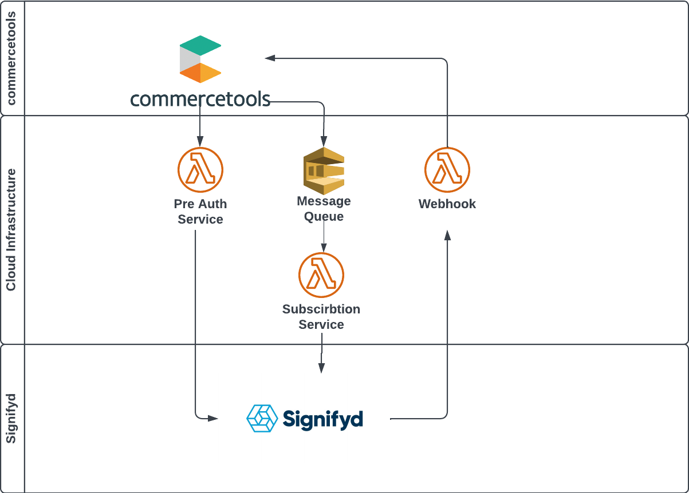

# Infrastructure

This integration could be either hosted on docker containers or deployed as serverless application. 

---

## -Serverless Infrastructure

This integration supports AWS, GCP and Azure serverless solutions with using respective components.

If only **post auth** flow used **pre auth node** doesn't need to deployed.

### Amazon Web Services

Components

- 3 Lamda

- Message Queue (either of them)
  
  - SNS
  
  - SQS

##### Lamda Function Configurations

**Required Envirenment Variables**

<mark>This configuration needs to be done for all functions</mark>

`JAVA_TOOL_OPTIONS = -XX:+TieredCompilation -XX:TieredStopAtLevel=1`

this is essential for performans improvement (for detail [AWS documentation]([Optimizing AWS Lambda function performance for Java | AWS Compute Blog](https://aws.amazon.com/blogs/compute/optimizing-aws-lambda-function-performance-for-java/)))

#### -Pre Auth Service

Recomended configuration is minumum **1024mb** Memory 

**Runtime Settings**

`Handler = com.signifyd.ctconnector.wrapper.aws.handler.PreAuthHandler`

#### -Subscription Service

**Lambda for SNS**

`Handler = com.signifyd.ctconnector.wrapper.aws.handler.SubscriptionsSNSHandler`

**Lambda for SQS**

`Handler = com.signifyd.ctconnector.wrapper.aws.handler.SubscriptionsSQSHandler`

#### -Webhook Service

`Handler = com.signifyd.ctconnector.wrapper.aws.handler.WebhookHandler`

### Google Cloud Platform

//todo

#### Azure

//todo

## -Dockerized Container Soution
