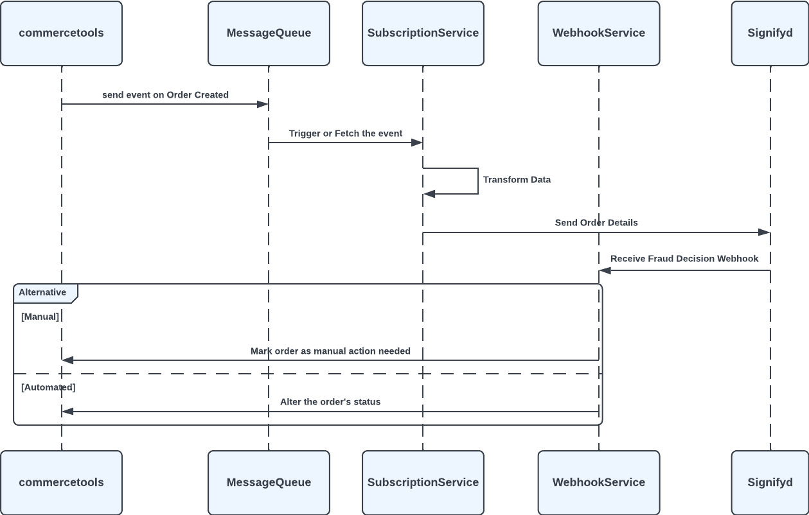

# Post Auth

    This flow provides asynchronous fraud detection capabilities. When an order is created using commercetools subscriptions integration receives an event and sends order details to Signifyd. After receiving respective webhook for decision configured actions are executed upon the order these are generally different state changes and can be customized by changing the config file.

*Sequence diagram for Post Auth Flow*

<mark>//todo increase detail maybe replace diagrams</mark>