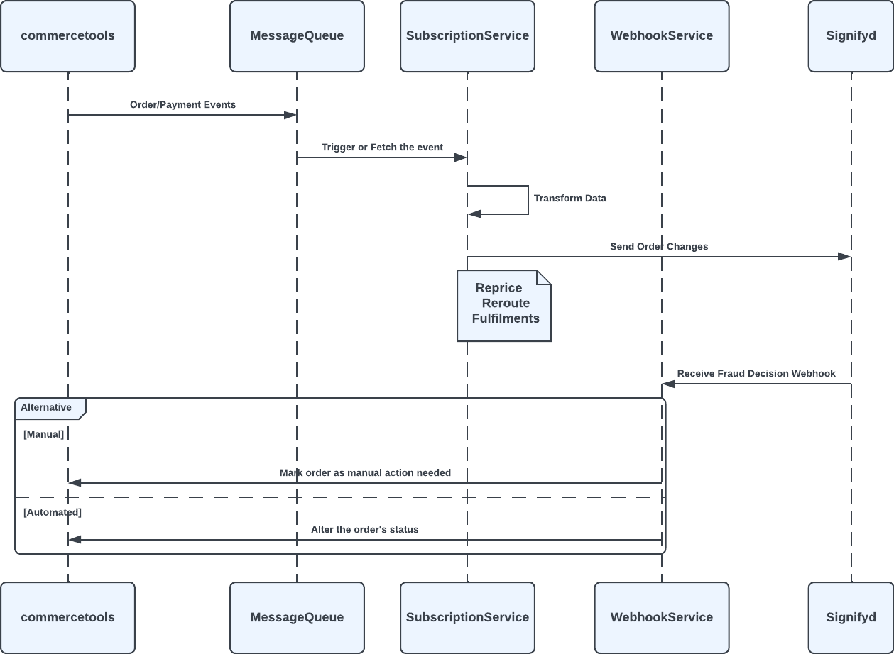

# Post Sale

     Signifyd requires additional information to provide better fraud detection capabilities to provide that this integration reports some order events to Signifyd

These events are:

- **Reroute**: when the shipping address changed

- **Fulfillment**: when a new delivery added

- **Reprice**: when order deliverables changed or any change resulted in a total price difference

*Sequence diagram for Post Sale event processig*

<mark>//todo increase detail maybe replace diagrams</mark>