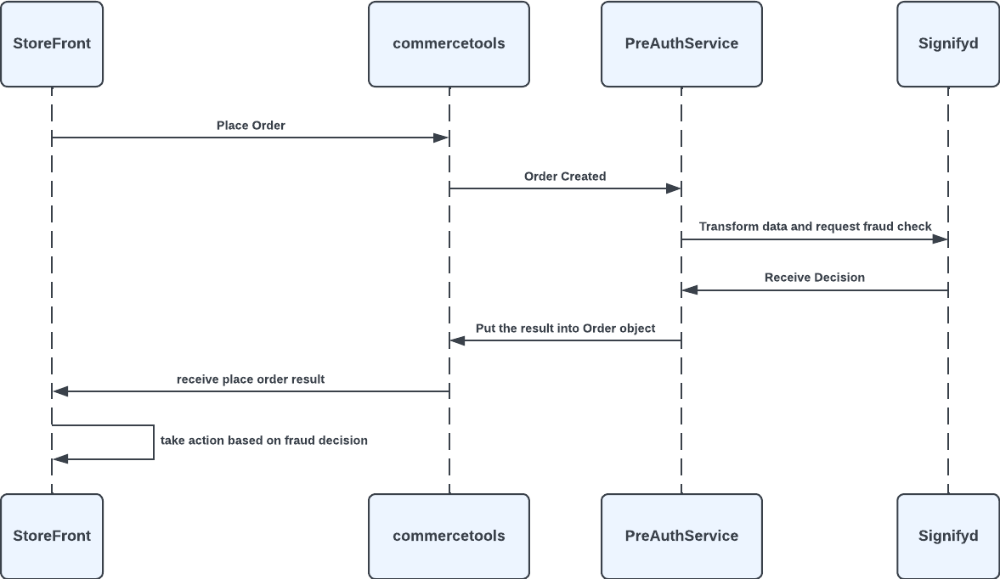
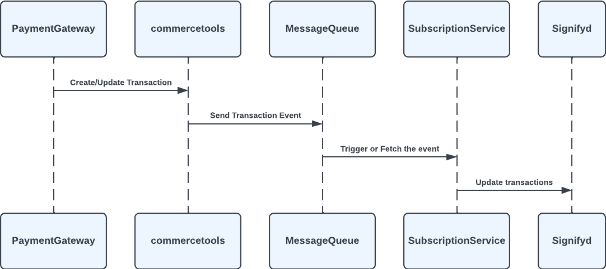

# Pre Auth

   With Pre Auth flow, merchants are able to perform fraud detection before order creation synchronously.

    This integration uses commercetools Api Extension extension methods to facilitate this functionality. When an order is created, Signifyd responses can be accessed through custom fields on order itself or even able to prevent the creation of rejected orders.

*Sequence Diagram for Pre Auth Flow*

    To finalize the fraud decision of order Pre Auth flow requires payment transaction updates. This integration provides that information using commercetools subscriptions. Payment transaction events received by message queues and transferred to respective Signifyd API

*Sequence Diagram for Pre Auth Transaction Flow*

<mark>//todo increase detail maybe replace diagrams</mark>